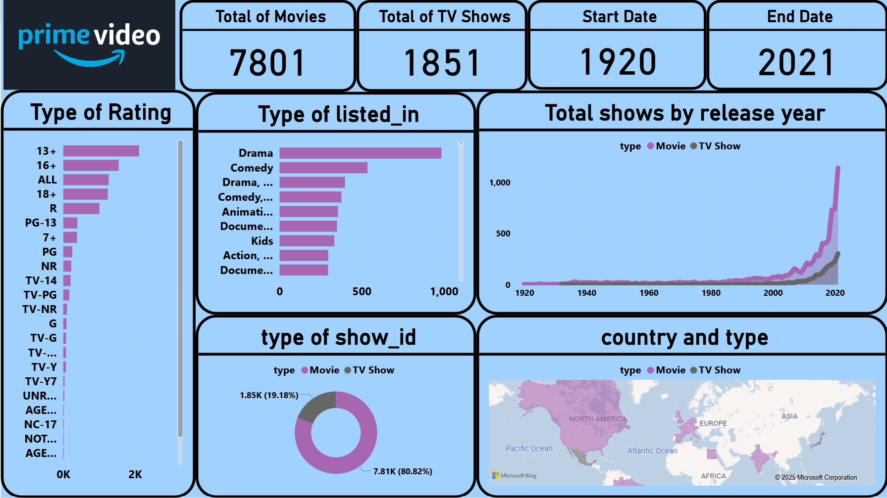

# Amazon Prime Video Analysis

## Project Overview
This project analyzes Amazon Prime movies and TV shows using Power BI and SQL to uncover content trends, ratings, genres, and production insights.

---

## Tools Used
- Power BI
- Excel

---

## Dataset
The dataset contains information about Amazon Prime movies and TV shows including:
- Genre
- Release Year
- Country
- Ratings
- Duration
- Type of Content

---

## Key Insights
- Over 7,800 movies and TV shows analyzed
- Drama was the most common genre
- Most content was produced in the United States
- Movies represented the majority of total content

---

## Dashboard Preview

---

## Author
Mohab Emad  
Data Analyst | Business Analyst
